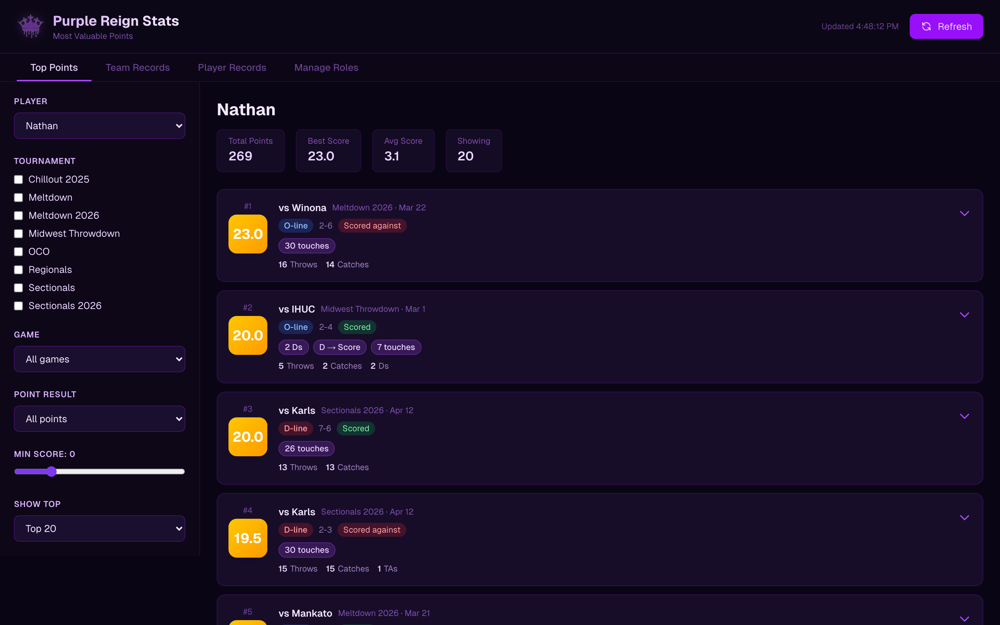
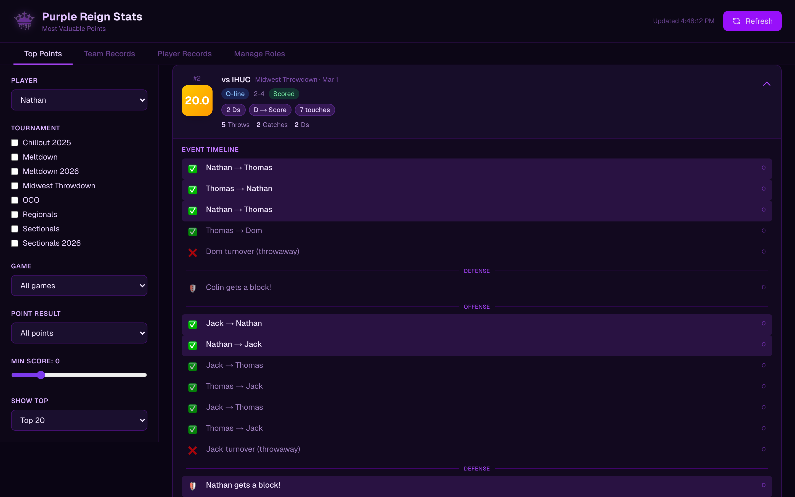
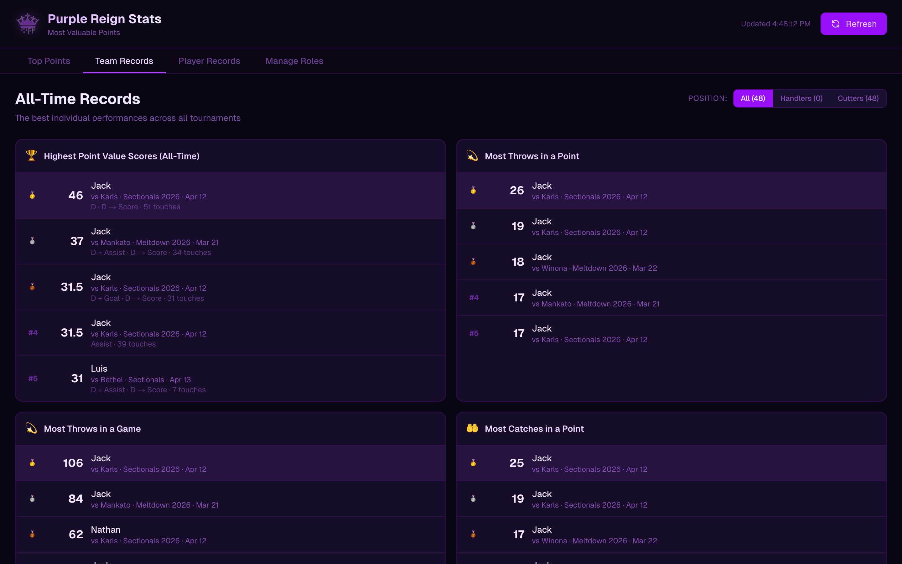

# Purple Reign Stats

**[Live App](https://purple-reign-stats.vercel.app/)** · Ultimate Frisbee analytics for a full competitive season



Box-score stats lie about ultimate. Goals, assists, and blocks describe three moments in a point that may have contained forty throws — so the players who quietly move the disc every possession show up as zeroes, and the player who caught one easy endzone pass leads the team.

Purple Reign Stats replaces the box score with a **per-point value model**. It pulls a season of event-level data from UltiAnalytics, reconstructs every point throw by throw, and scores each player's contribution to *that specific point* — so you can ask "what were Nathan's twenty most valuable points this season?" and get an answer that accounts for the whole possession, not just who touched it last.

Built for my team, Purple Reign, and running on our real season data: 8 tournaments, 48 players.

## The scoring model

This is the actual argument of the project, so it's worth being explicit about what it asserts. Every action in a point maps to a weight:

| Action | Weight | What this position asserts |
|---|---:|---|
| Completion (thrower) | **+1** | The baseline unit of offense. The thrower made a decision and it worked. |
| Catch (receiver) | **+0.5** | Worth less than the throw. The throw carries the risk; the catch usually carries less. |
| Goal | **+5** | The terminal act that banks the point. |
| Assist | **+3** | Below a goal here — a deliberate, arguable choice (see below). |
| Defensive block | **+4** | Rated *above* an assist. A D is a full possession swing; an assist is one throw in a possession you already owned. |
| Callahan | **+10** | A block that is simultaneously a goal. The rarest play in the sport. |
| Throwaway | **−3** | |
| Drop | **−2** | Deliberately lighter than a throwaway — **the thrower bears more blame than the receiver.** A drop is often a bad throw. |
| Stall | **−3** | Priced identically to a throwaway. A stall is a throwaway you declined to make. |
| Pull | **+0.5** | Small credit for a job someone has to do. |
| Pull out-of-bounds | **−1** | |

### The two bonuses that make it work

Weights alone still reduce a point to a bag of independent events. Two bonuses read the *structure* of the possession:

- **Chain bonus (+2)** — awarded when a player touches the disc **3 or more times in the scoring possession**. This is the fix for the box-score problem: the handler who resets five times to build the point gets credit for building it.
- **Impact sequence (+3 each)** — awarded when a player **gets a block and then touches the disc on the possession that block created**. Getting the D is one thing; converting your own turnover into offense is the play that actually wins games.



Every score is fully auditable — expand any point and you get the play-by-play that produced it, with the selected player's involvement highlighted and possession changes marked.

The weights live in one exported object (`DEFAULT_WEIGHTS` in [`src/lib/scoring.ts`](src/lib/scoring.ts)) and every scoring function takes them as an argument, so disagreeing with the model above is a matter of passing a different object — not rewriting the engine. If you think an assist should outrank a goal, you can price it that way and re-rank the whole season.

## Features

- **Top points leaderboard** — any player's highest-value points, with a full breakdown of how each score was assembled
- **Event timeline** — expand a point for the throw-by-throw sequence, possession changes marked, the selected player's actions highlighted
- **Team records** — all-time leaderboards across the season (highest point value, most throws in a point, most catches in a game), filterable by handler/cutter role
- **Player records** — per-player personal bests and milestones
- **Filters** — by player, tournament, game, point result, and minimum score
- **Role management** — assign handler/cutter roles, which feed the record filters



## Architecture

```
UltiAnalytics CSV export
        │
        ▼
  /api/stats  ──── server-side proxy (avoids browser CORS on the upstream API)
        │
        ▼
  lib/parser.ts ── flat event rows → nested Point objects (grouped by game + point,
        │           with players-on-field and possession boundaries resolved)
        ▼
  lib/scoring.ts ─ per-player, per-point value model (weights + chain/impact bonuses)
        │
        ▼
  StatsProvider ── React context; fetch, parse, and score once, share everywhere
        │
        ▼
   UI components
```

The whole pipeline runs client-side after a single CSV fetch — no database, no build step over the data. Re-scoring the full season with different weights is instantaneous because it never leaves memory.

```
src/
├── app/
│   ├── page.tsx              # Tabs, filter state
│   ├── layout.tsx
│   └── api/stats/route.ts    # CSV proxy to UltiAnalytics
├── components/
│   ├── StatsProvider.tsx     # Context: fetch → parse → score
│   ├── Sidebar.tsx           # Filter controls
│   ├── TopPointsList.tsx
│   ├── PointCard.tsx         # Score breakdown + expand
│   ├── EventTimeline.tsx     # Play-by-play with possession markers
│   ├── RecordsBoard.tsx
│   ├── PlayerRecords.tsx
│   ├── RoleManager.tsx
│   └── Header.tsx
└── lib/
    ├── types.ts              # RawEvent, Point, ScoringWeights, ScoreBreakdown
    ├── parser.ts             # CSV → grouped points
    ├── scoring.ts            # The value model
    └── records.ts            # Records computation
```

## Tech stack

Next.js 16 (App Router), React 19, TypeScript, Tailwind CSS v4, PapaParse.

## Running locally

```bash
npm install
npm run dev
```

Open [http://localhost:3000](http://localhost:3000). The app fetches live data from UltiAnalytics on load — no database, API keys, or seed data required.

## Known limitations

- **Weights are unvalidated.** They encode reasoned opinions about ultimate, not a fit against a win-probability model. A player's score is a measure of *involvement weighted by judgment*, not a proven contribution to winning.
- **Possession reconstruction is heuristic.** `getScoringPossessionTouches` walks the event log backward to find the scoring possession's start; unusual event sequences in the source data can end that walk early.
- **Touch counts overstate disc-handling.** Catching and then throwing registers twice — once as receiver on one event, once as passer on the next — so a "30 touches" point reflects roughly half that many actual possessions of the disc. The number is consistent across players, so it ranks correctly; it just isn't a literal count.
- **Single-team scope.** The upstream team ID is hardcoded in the API route; supporting other teams means making it a parameter.
